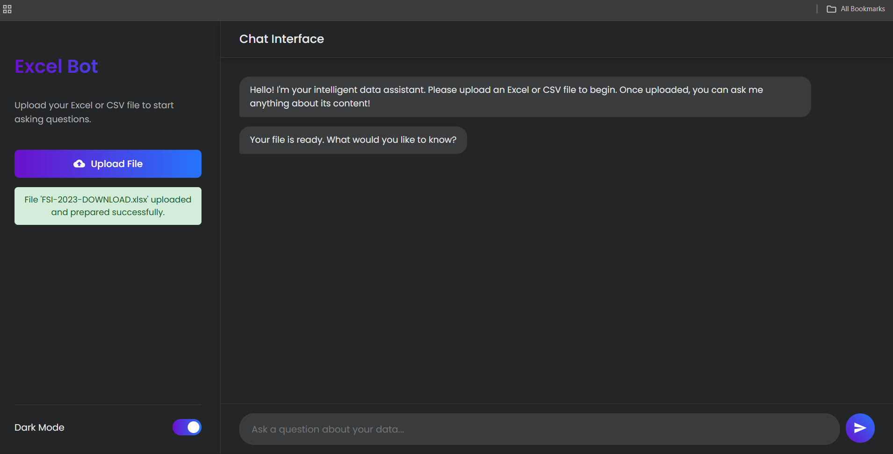

# 💬 AI-Powered Excel Chatbot

An intelligent and interactive web-based chatbot that allows users to upload Excel or CSV files and ask natural language questions about their data — all processed locally using lightweight AI models.

This project was developed with the help of an **AI-assisted development workflow**, combining human creativity with intelligent guidance tools to design, refine, and optimize each part of the system. It represents a balanced collaboration between **human logic** and **AI precision**.

Built as a practical exploration of AI-driven data interaction, the chatbot integrates **Flask**, **Pandas**, and **Cohere embeddings** to deliver dynamic insights in a conversational, human-friendly interface.

---

## 🌟 Key Features

* 📁 **Excel/CSV Upload Support:** Seamlessly upload and analyze your data files.
* 💬 **Conversational Chat Interface:** Ask questions in plain English and get instant insights.
* 🧠 **AI-Powered Understanding:** Uses Cohere embeddings and rule-based interpretation for meaningful responses.
* 🍗 **Dual Theme Design:** Light and dark modes for user comfort.
* 🎨 **Modern UI:** Minimal, smooth, and responsive design.
* ⚡ **Lightweight & Local:** Runs efficiently on local systems with minimal resources.

---

## 🛠️ Tech Stack

| **Component**            | **Technology**             |
| ------------------------ | -------------------------- |
| Backend                  | Flask (Python)             |
| Frontend                 | HTML, CSS, JavaScript      |
| Data Handling            | Pandas, PandasQL, OpenPyXL |
| AI / Language Processing | Cohere API                 |
| Environment Management   | Python-dotenv              |
| Visualization (Future)   | Matplotlib                 |

---

## 🚀 Project Overview

The **AI-Powered Excel Chatbot** was created with one core idea — making **data exploration natural and intelligent**.

Users can upload their Excel or CSV files, and the chatbot interprets questions like:

* “Who scored the highest marks?”
* “Show me the average sales by region.”
* “How many employees joined after 2020?”

When questions are vague or analytical, the system generates **AI-written paragraph summaries**, showing how structured data and natural language can blend seamlessly.

---

## 🧩 Limitations & Notes

* This chatbot is designed for **lightweight, local AI-based data analysis**.
* Due to limited system configuration, it currently uses **smaller AI models** — which may not handle very complex or reasoning-heavy queries.
* At present, I’m not planning to upgrade this version, but it remains a great example of building a **functional AI application with limited resources**.

---

## 🖼️ Demo Screenshots

| **File Upload Success**                             | **Query Response Example**                                |
| --------------------------------------------------- | --------------------------------------------------------- |
|  |  |

### Example Folder Structure

```
/screenshots   
├── file_upload_success.png  
└── query_response_example.png  
```

---

## ⚙️ Installation & Usage

### 1️⃣ Clone the Repository

```bash
git clone https://github.com/<your-username>/<repo-name>.git  
cd <repo-name>
```

### 2️⃣ Set Up Virtual Environment

```bash
python -m venv venv  
venv\Scripts\activate       # (Windows)  
source venv/bin/activate    # (Mac/Linux)
```

### 3️⃣ Install Dependencies

```bash
pip install -r requirements.txt
```

### 4️⃣ Run the Application

```bash
python app.py
```

### 5️⃣ Access the Web App

Open your browser and go to 👉 **[http://127.0.0.1:5000](http://127.0.0.1:5000)**

---

## 📦 Requirements File

```
Flask  
pandas  
openpyxl  
cohere  
pandasql  
python-dotenv  
matplotlib  
```

---

## 💡 Future Scope

* Integrate larger LLMs (e.g., Phi-3, LLaMA, or Mistral) for advanced reasoning.
* Add **data visualizations** from user queries.
* Enable **data export** of chat insights.
* Deploy via **Render** or **Hugging Face Spaces** for public access.

---

## 👩‍💻 Author

**Kiruthika T**
B.Tech – Artificial Intelligence & Data Science
📍 Tamil Nadu, India

🌐 **LinkedIn:** [Kiruthika T](https://www.linkedin.com/in/kiruthika-t-1812b327a)

---

## 💬 A Personal Note

This project reflects my **personal journey in AI and Data Science**, created through the combined power of **human design thinking** and **AI-based development tools**. Using AI assistance during the build process helped refine both technical efficiency and user experience.

It began as a simple curiosity-driven idea — to make **data communication more human** — and evolved into a functioning system that brings AI closer to everyday interaction.

Through this project, I learned how **AI can amplify creativity rather than replace it**. Every feature, from backend to UI, was shaped through experimentation, feedback, and iteration with AI tools.

This work stands as a reflection of my growth as an **AI developer and innovator**, and a milestone in my continuous journey to explore how **human creativity and AI technology can coexist productively**.

---
